<head>
  <title>Two Photos Side by Side</title>
  <link rel="stylesheet" href="../style.css">
</head>

Software projects that I've built/contributed to.

## InvolveMINT
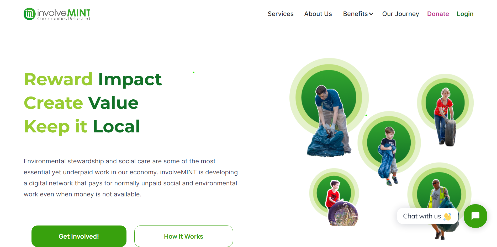

As part of the <a target="_blank" href="https://www.developforgood.org/">Develop For Good</a> Winter 2024 cohort I am working in a team of 7 devs to migrate InvolveMINT's backend API functionality from NestJS into C#/.NET including the data access layer from TypeORM to Entity Framework. This way the non-profit improves site security and long term scalability by moving away from the sunsetted open source framework <a target="_blank" href="https://github.com/jczacharia/orcha">OrchaJS</a> that dominates the backend.

Stack: C#/.NET, Angular, NestJS, Typescript, Docker, Entity Framework (EF6), Firebase (Auth/Firestore), PostgreSQL, Git

<a target="_blank" href="https://github.com/involveMINT/iMPublic">GitHub</a>&emsp;
<a target="_blank" href="https://involvemint.io/">Site</a>

## WhereU@
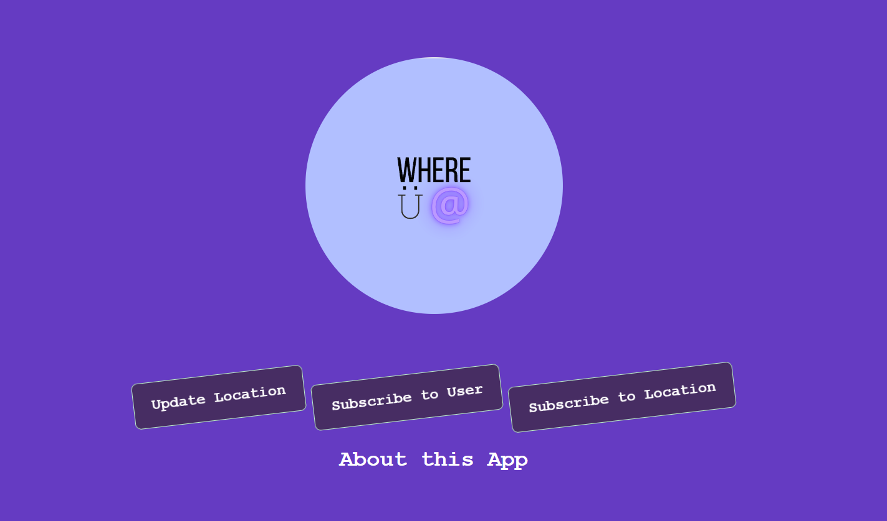

 Mid-animation landing page 
  

Worked in a team of 4 during NWHacks 2023 to develop a full-stack web-application to fight against FOMO where users can subscribe to one another or a location and be notified when that user moves locations or when any user moves to a subscribed location. Inspired by snapchat's location tracking feature, but without the data collection.

Stack: Java, Spring Boot, React.js, CockroachDB, HTML, CSS, JavaScript, Twilio API, Axios, Postman

<a target="_blank" href="https://github.com/JohnsonL111/where-u-at">GitHub</a>&emsp;
<a target="_blank" href="https://devpost.com/software/whereu">DevPost</a>

## Sigma.IO
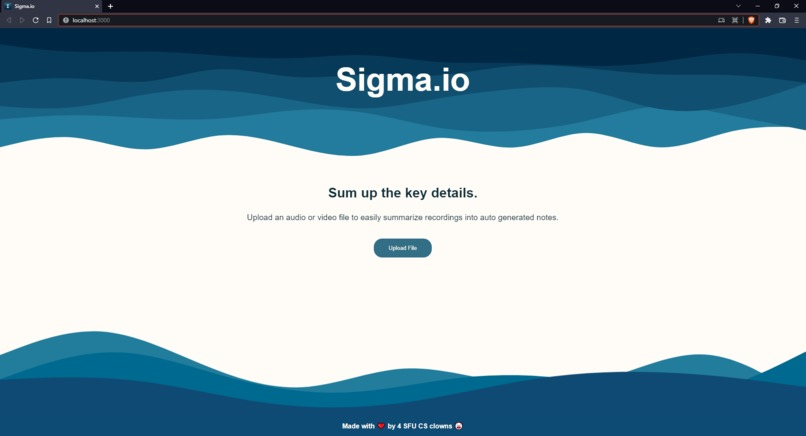

Worked in a team of 4 during Stormhacks 2022 to build a web application that takes in audio or video file input and outputs a summary of the uploaded content.

Stack: ReactJS, AssemblyAI API, HTML, CSS, Javascript, Git

<a target="_blank" href="https://github.com/JohnsonL111/Sigma.io">GitHub</a>&emsp;
<a target="_blank" href="https://sigmaio.netlify.app/">Site </a> &emsp;
<a target="_blank" href="https://www.youtube.com/watch?v=9fAU0wKU-hQ">Demo</a>

## FindMyPig
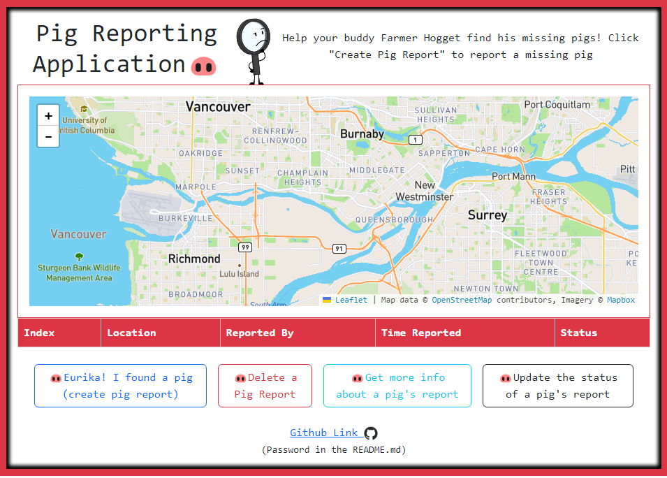

For my Web Development I final project I developed an angular CRUD pig locator web application. Here you can report missing pigs and visualize their locations on a live map courtesy of Leaflet 

Stack: Angular, Typescript, HTML, Bootstrap (CSS), Leaflet API, Postman

<a target="_blank" href="https://github.com/JohnsonL111/find-my-pig">GitHub</a>&emsp;
<a target="_blank" href="https://findmypig.netlify.app/">Site </a>

## 1-2-Tree: Parenting Made Easy

  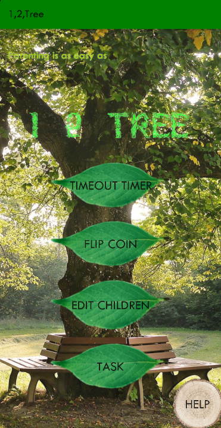
  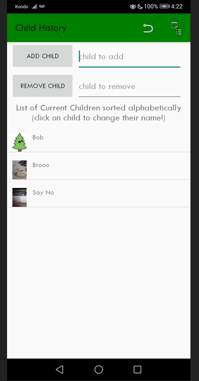

For my Intro to Software Engineering Class I worked in a team of 4 in an agile scrum format to build an android app to help parents cope with having children. The app allows for CRUD on children and on task assignment (start 'em early), a coin flip feature to arbitrate decisions, a timeout feature, and breathing exercises based off a state machine.

Stack: Java, Android Studio, SharedPreferences, Git

<a target="_blank" href="https://github.com/JohnsonL111?page=2&tab=repositories">GitHub</a>&emsp;

## Bitcoin Minefinder Game

  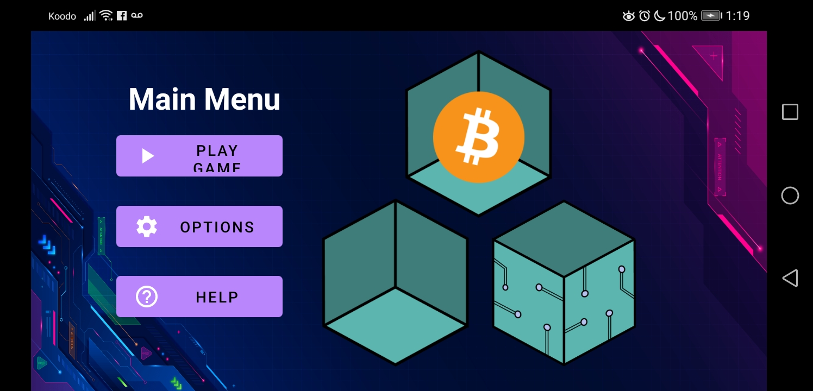
  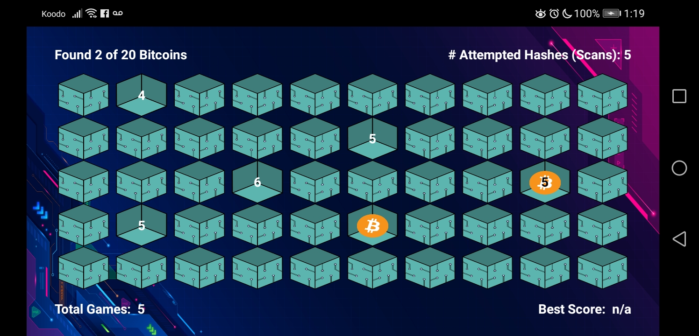

Worked in a team of 2 to develop a bitcoin themed mine finder android game based off minesweeper. Users can configure the number of bitcoins and blockchain size. The best score is saved.

Stack: Java, Android Studio, SharedPreferences, Git

<a target="_blank" href="https://github.com/JohnsonL111/Totally-Accurate-Bitcoin-Mining-Simulator?tab=readme-ov-filetab=repositories">GitHub</a>&emsp;

## NutriNote
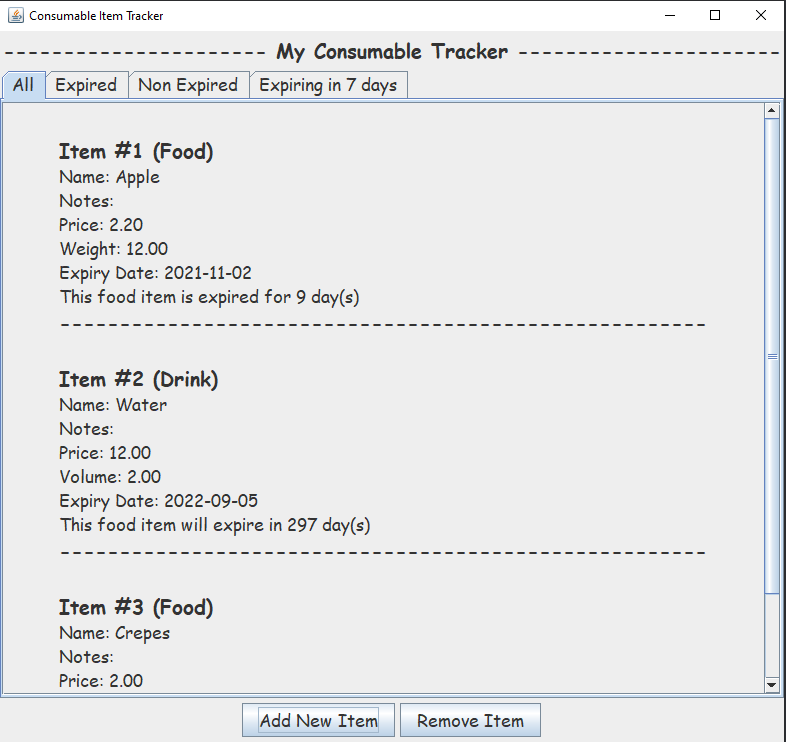

A desktop app to manage the expiry dates of your refridgerator items through CRUD operations. Developed with a Swing GUI frontend and Spring Boot RESTful backend. Utilizes Gson to serialize/deserialize POJO to Json Objects to seamlessly save/load item information respectively.

Stack: Java, Spring Boot, Swing GUI, REST API, Gson, HTTP Client

<a target="_blank" href="https://github.com/JohnsonL111/nutri-note">GitHub</a>&emsp;

## Space Oddysey
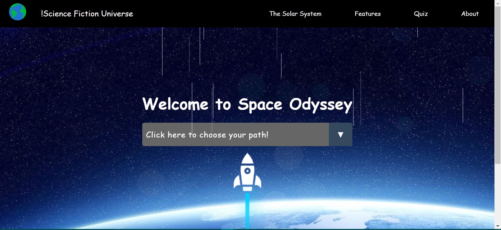

My friends and I decided to build a space exploration site at our first hackathon: SOSY's Hackademia. This was back before we even knew how to code (heck, we used google docs as version control). It's a pretty simple site with fun facts, a space quiz, and a space visualizer.

Stack: HTML, CSS, Javascript, Jquery

<a target="_blank" href="https://github.com/JohnsonL111/Space-Odyssey">GitHub</a>&emsp;
<a target="_blank" href="https://spaceodysseyhackademia.netlify.app/">Site</a>&emsp;

## Memory Card Game
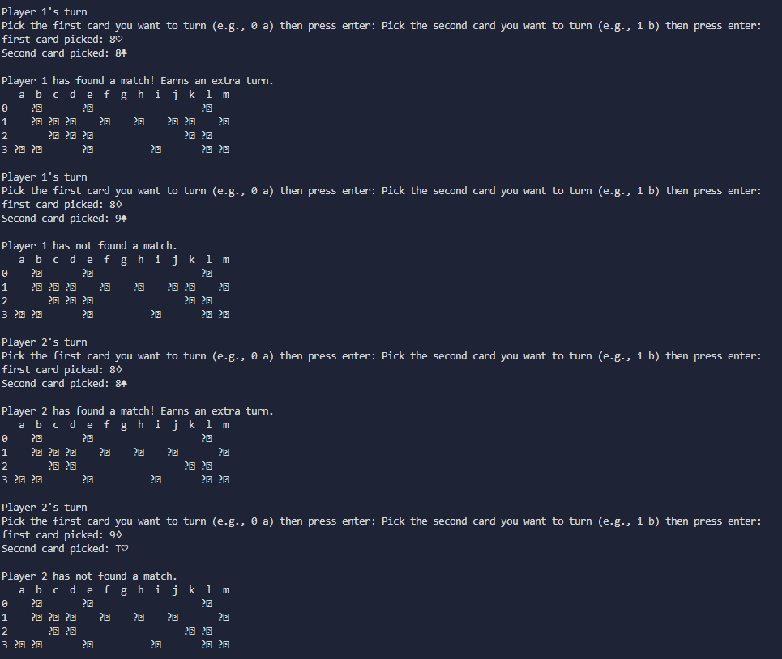

Terminal implementation of the <a target="_blank" href="https://en.wikipedia.org/wiki/Concentration_(card_game)">Concentration</a> card game.

Stack: C

<a target="_blank" href="https://github.com/JohnsonL111/Concentration-Memory-Card-Game">GitHub</a>&emsp;