<head>
  <title>Two Photos Side by Side</title>
  <link rel="stylesheet" href="../style.css">
  
</head>

> Software projects that I've built/contributed to.

## Argus: Git for quant researchers, secured by blockchain

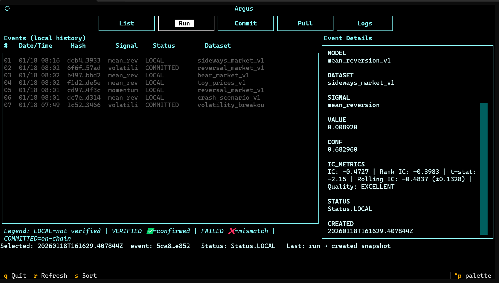

 

<iframe
  width="100%"
  height="400"
  src="https://www.youtube.com/embed/p849nn0xS1k"
  title="Argus Demo"
  frameborder="0"
  allow="accelerometer; autoplay; clipboard-write; encrypted-media; gyroscope; picture-in-picture"
  allowfullscreen>
</iframe>

**Argus** is a Git-like versioning tool for quantitative researchers built on the Solana blockchain. It enables deterministic and immutable replayability of version-controlled models and datasets, making experimentation, iteration, and auditing of quantitative signals transparent and verifiable.

Argus brings familiar developer workflows to quantitative research while adding cryptographic guarantees around data integrity and provenance. By anchoring version metadata on-chain and maintaining a lightweight local index, the system ensures that model runs can be reliably reproduced and independently verified.

**Stack:** Python, Textual, Rust, Anchor, Solana, Vultr, SQLite

🏆*Won "Best use of Solana" at NWHacks 2026 (650+ hackers)*  
<a target="_blank" href="https://github.com/JohnsonL111/argus">GitHub</a>&emsp;
<a target="_blank" href="https://devpost.com/software/argus-fgtsu5">Devpost</a>&emsp;

## Hope Health Action: Community Based Rehabilitation Application

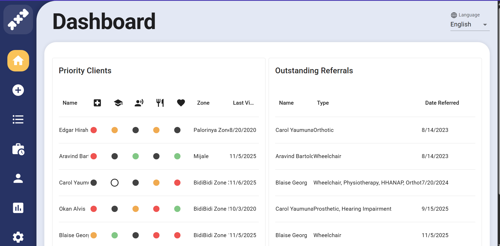

Developing the web and mobile application supporting community based rehabilitation services as part of SFU research projects for HHA, a non-profit. Primarily working on test automation and features to the mobile client.

**Stack:** React Native, Expo, Django, Python, Docker, Postgres

<a target="_blank" href="https://github.sfu.ca/bfraser/415-HHA-CBR">GitHub</a>&emsp;

## BotBouncers: AI Edge Bot Access Control & Observability

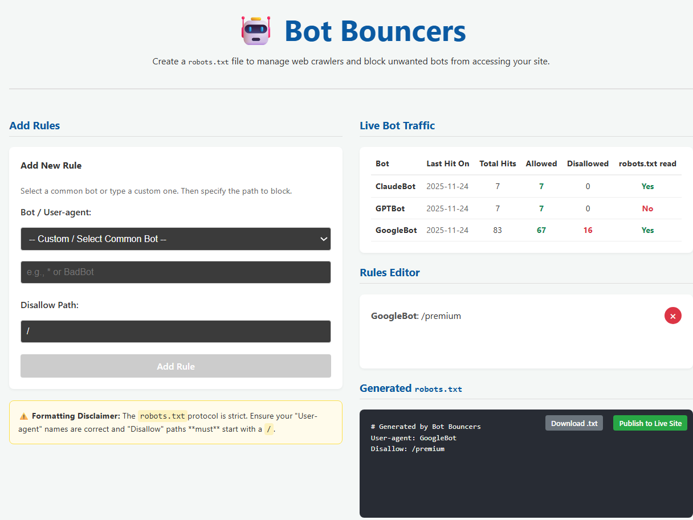
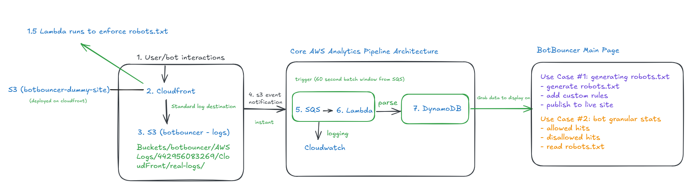

I built an AI-focused bot access control layer that runs at the CDN edge, allowing users to generate and enforce `robots.txt` rules per-crawler using AWS CloudFront + Lambda@Edge. The system inspects CloudFront logs streamed through S3 and SQS into an analytics Lambda, which aggregates per-bot, per-path metrics into DynamoDB. A React-based dashboard lets site owners configure bot policies, view allowed vs. disallowed traffic over time, and safely test changes without redeploying the site.

Stack: AWS CloudFront, Lambda@Edge, S3, SQS, API Gateway, DynamoDB, React, Typescript, NodeJS

<a target="_blank" href="https://github.com/JohnsonL111/botbouncer">GitHub</a>&emsp;

## Reel Youth – Mobile-First Headless Website (Technical Project Lead)

<table>
  <tr>
    <td></td>
    <td></td>
  </tr>
  <tr>
    <td></td>
    <td></td>
  </tr>
</table>

As Technical Project Lead at SFU Blueprint, I led a team of developers and designers to build Reel Youth’s new mobile-first website from 0→1 using a fully headless architecture. We created a custom WordPress CMS w/ 15+ custom post types based on the NPOs needs and integrated it with a Next.js/GraphQL frontend, enabling the NPO to easily manage programs, films, and marketing content. 

I met with the client along with the PM/Designers, oversaw technical direction/systems architecture, CI/CD pipelines, developer onboarding, and implemented core features including the page for managing historical films and programs, a manual publish trigger enabling staff to push CMS changes live with one click, and Cloudflare deployment for fast global performance.

Stack: Next.js, Typescript, GraphQL/Apollo, Faust.js, Supabase (postgres + serverless typescript APIs), Storybook, Headless WordPress, Cloudflare

<a target="_blank" href="https://reelyouth-demo.xyz/">Deployment</a>&emsp;
<a target="_blank" href="https://github.com/SFU-Blueprint/Reel-Youth">GitHub</a>&emsp;

## MOSAIC - AI Conversational ChatBot (Developer)
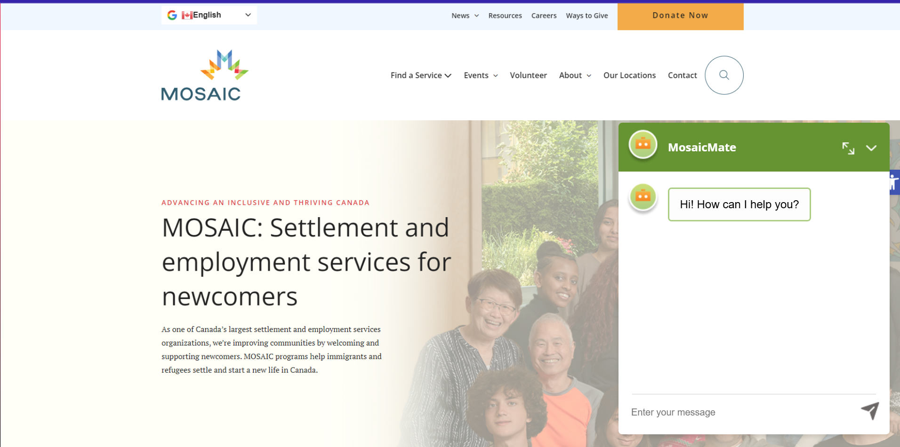

As a developer on this project through SFU blueprint my 2 primary contributions were to  
(1) provide a method to automate the process to update the neo4J graph database with new program data and to  
(2) Provide a POC for transferring the chatbot react application to wordpress with full feature parity along with writing/filming documentation for the npo to replicate steps.

Stack: React, Typescript, Tailwind, Python, Langchain, Neo4J

<a target="_blank" href="https://mosaicmate.vercel.app/">Deployment</a>&emsp;

## InvolveMINT

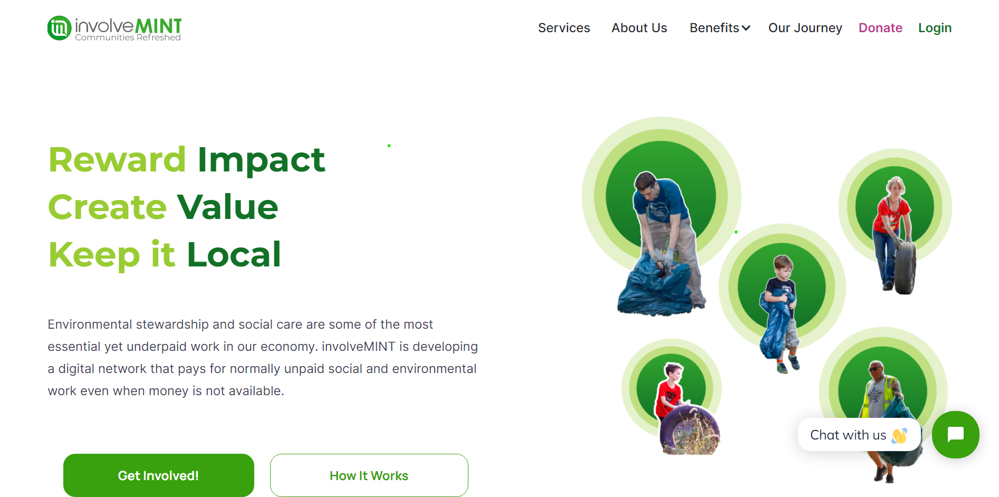

As part of the <a target="_blank" href="https://www.developforgood.org/">Develop For Good</a> Winter 2024 cohort I worked on a team of 7 devs to migrate InvolveMINT's backend API functionality into NestJS. This way the non-profit improves site security and long term scalability by moving away from the sunsetted open source framework <a target="_blank" href="https://github.com/jczacharia/orcha">OrchaJS</a> that dominates the backend.

Stack: NestJS, Typescript, NodeJS, Angular, Jest, TypeORM, Docker, Firebase (Auth/Firestore), PostgreSQL, Git

<a target="_blank" href="https://github.com/involveMINT/iMPublic">GitHub</a>&emsp;
<a target="_blank" href="https://app.involvemint.io/">Deployment</a>

## WhereU@

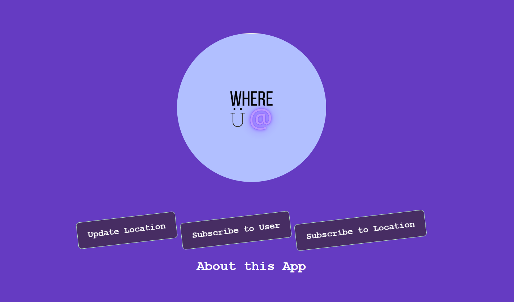

 Mid-animation landing page 
  

Worked in a team of 4 during NWHacks 2023 to develop a full-stack web-application to fight against FOMO where users can subscribe to one another or a location and be notified when that user moves locations or when any user moves to a subscribed location. Inspired by snapchat's location tracking feature, but without the data collection.

Stack: Java, Spring Boot, React.js, CockroachDB, HTML, CSS, JavaScript, Twilio API, Axios, Postman

<a target="_blank" href="https://github.com/JohnsonL111/where-u-at">GitHub</a>&emsp;
<a target="_blank" href="https://devpost.com/software/whereu">DevPost</a>

## Sigma.IO

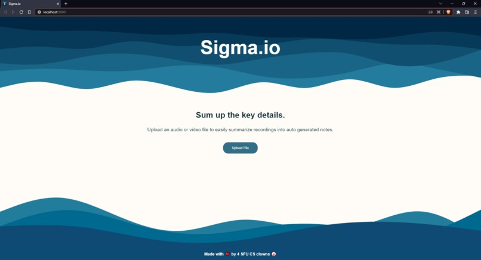

Worked in a team of 4 during Stormhacks 2022 to build a web application that takes in audio or video file input and outputs a summary of the uploaded content.

Stack: ReactJS, AssemblyAI API, HTML, CSS, Javascript, Git

<a target="_blank" href="https://github.com/JohnsonL111/Sigma.io">GitHub</a>&emsp;
<a target="_blank" href="https://sigmaio.netlify.app/">Deployment </a> &emsp;
<a target="_blank" href="https://www.youtube.com/watch?v=9fAU0wKU-hQ">Demo</a>

## BookWise

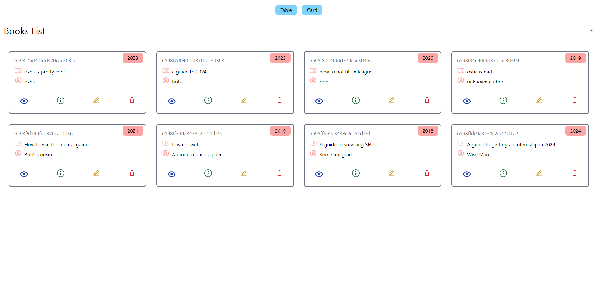
Full-stack web app to track your book collection. Uses mongoose ORM to abstract DB operations. Features toggleable Table/Card view and alerts. More features to come :).

Stack: Nodejs, Expressjs, MongoDB, Mongoose, ReactJs, Tailwind, Vite, Axios

<a target="_blank" href="https://github.com/JohnsonL111/book-wise">GitHub</a>&emsp;

## FindMyPig

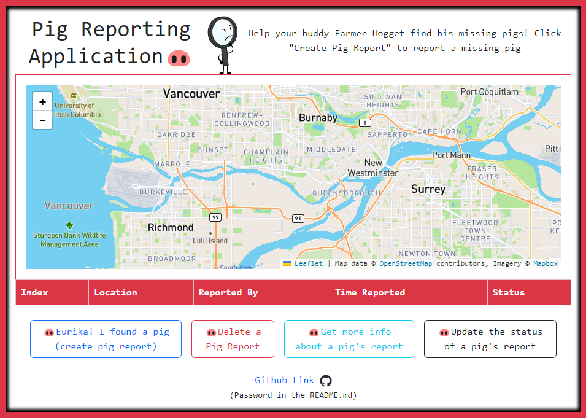

For my Web Development I final project I developed an angular CRUD pig locator web application. Here you can report missing pigs and visualize their locations on a live map courtesy of Leaflet

Stack: Angular, Typescript, HTML, Bootstrap (CSS), Leaflet API, Postman

<a target="_blank" href="https://github.com/JohnsonL111/find-my-pig">GitHub</a>&emsp;
<a target="_blank" href="https://findmypig.netlify.app/">Deployment </a>

## 1-2-Tree: Parenting Made Easy

  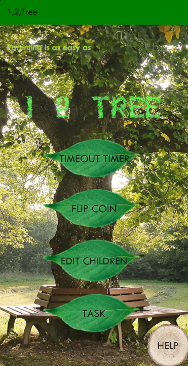
  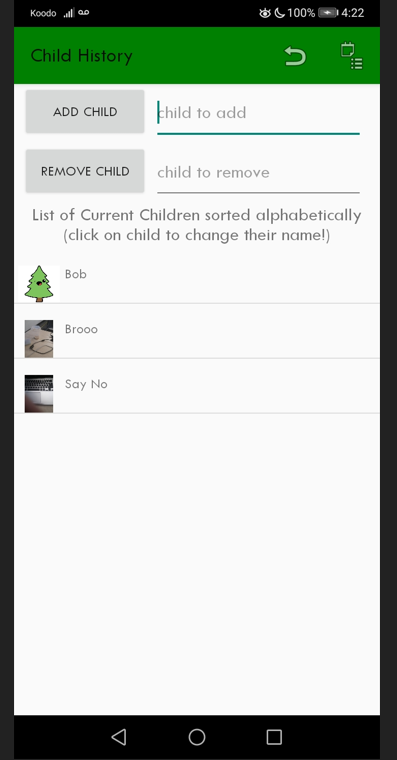

For my Intro to Software Engineering Class I worked in a team of 4 in an agile scrum format to build an android app to help parents cope with having children. The app allows for CRUD on children and on task assignment (start 'em early), a coin flip feature to arbitrate decisions, a timeout feature, and breathing exercises based off a state machine.

Stack: Java, Android Studio, SharedPreferences, Git

<a target="_blank" href="https://github.com/JohnsonL111?page=2&tab=repositories">GitHub</a>&emsp;

## Bitcoin Minefinder Game

  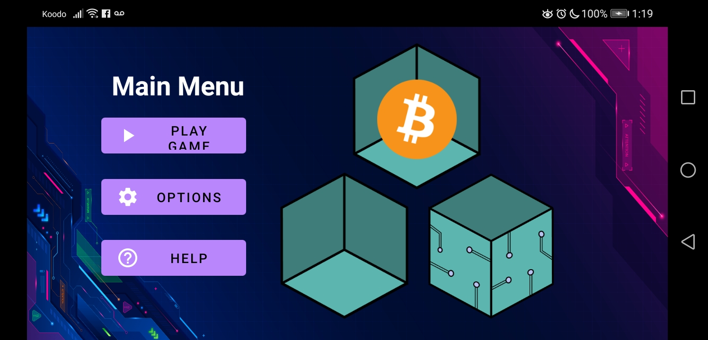
  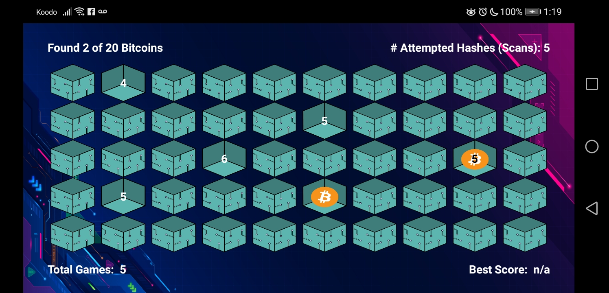

Worked in a team of 2 to develop a bitcoin themed mine finder android game based off minesweeper. Users can configure the number of bitcoins and blockchain size. The best score is saved.

Stack: Java, Android Studio, SharedPreferences, Git

<a target="_blank" href="https://github.com/JohnsonL111/Totally-Accurate-Bitcoin-Mining-Simulator?tab=readme-ov-filetab=repositories">GitHub</a>&emsp;

## NutriNote

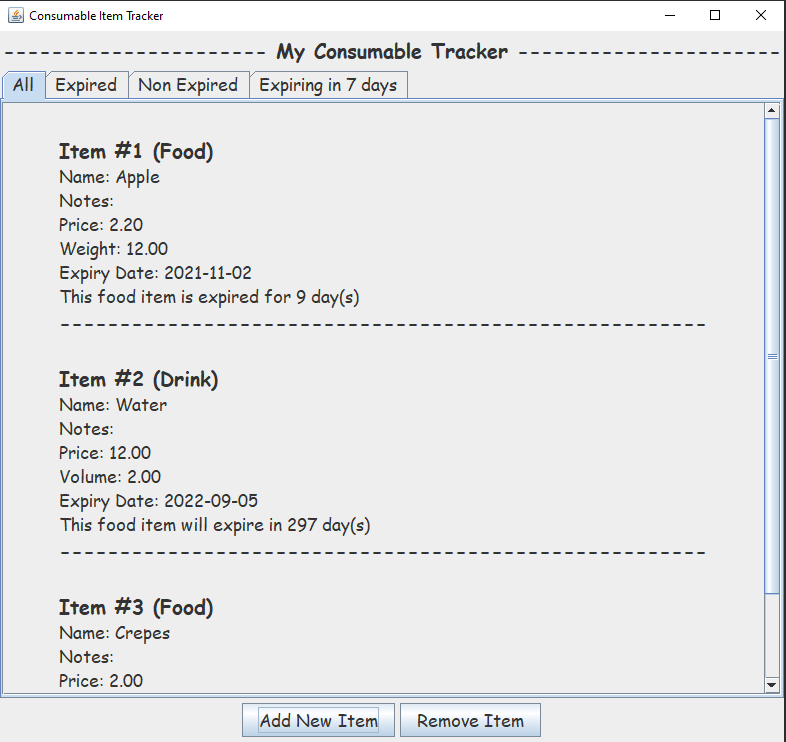

A desktop app to manage the expiry dates of your refridgerator items through CRUD operations. Developed with a Swing GUI frontend and Spring Boot RESTful backend. Utilizes Gson to serialize/deserialize POJO to Json Objects to seamlessly save/load item information respectively.

Stack: Java, Spring Boot, Swing GUI, REST API, Gson, HTTP Client

<a target="_blank" href="https://github.com/JohnsonL111/nutri-note">GitHub</a>&emsp;

## Space Oddysey

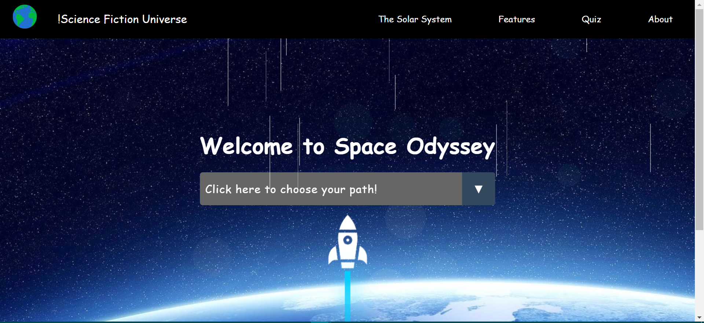

My friends and I decided to build a space exploration site at our first hackathon: SOSY's Hackademia. This was back before we even knew how to code (heck, we used google docs as version control). It's a pretty simple site with fun facts, a space quiz, and a space visualizer.

Stack: HTML, CSS, Javascript, Jquery

<a target="_blank" href="https://github.com/JohnsonL111/Space-Odyssey">GitHub</a>&emsp;
<a target="_blank" href="https://spaceodysseyhackademia.netlify.app/">Deployment</a>&emsp;

## Memory Card Game

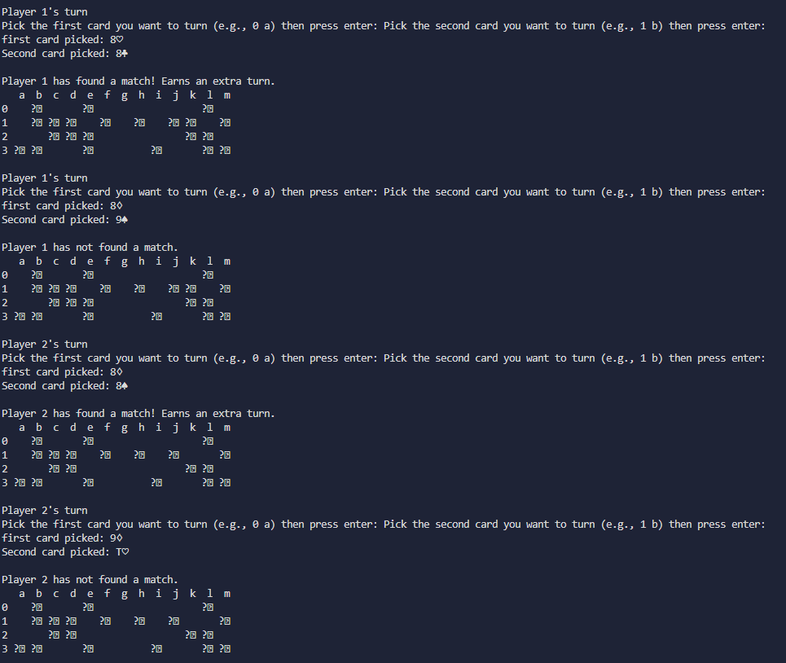

Terminal implementation of the <a target="_blank" href="https://en.wikipedia.org/wiki/Concentration_(card_game)">Concentration</a> card game.

Stack: C

<a target="_blank" href="https://github.com/JohnsonL111/Concentration-Memory-Card-Game">GitHub</a>&emsp;

