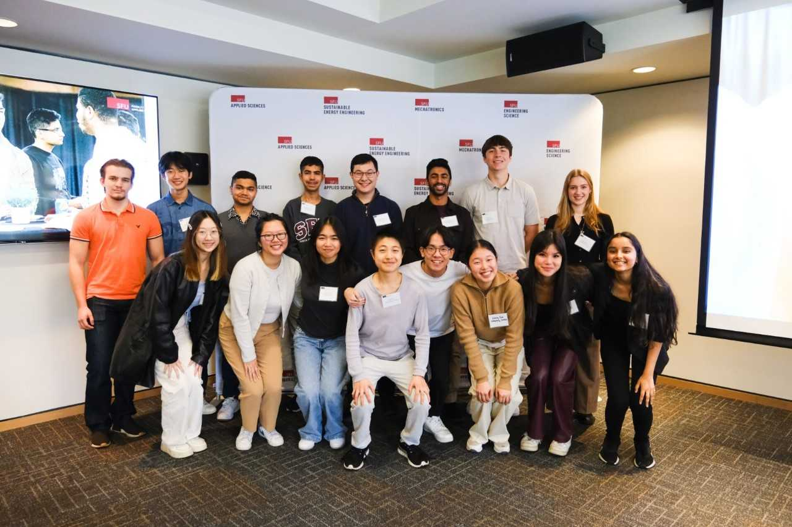
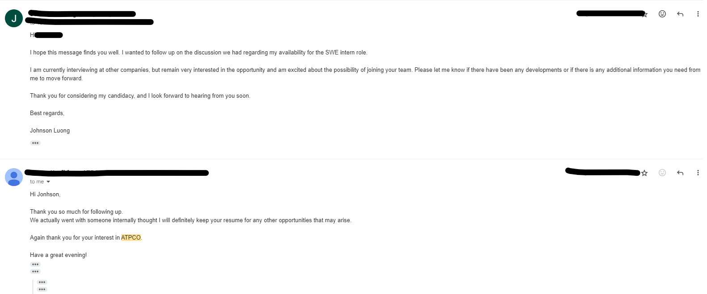
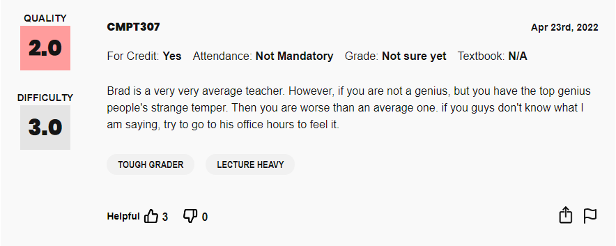
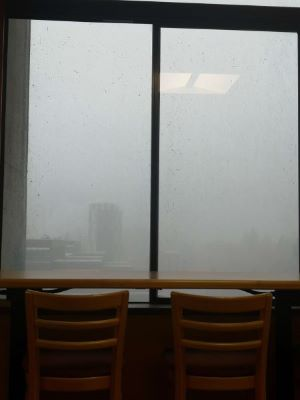
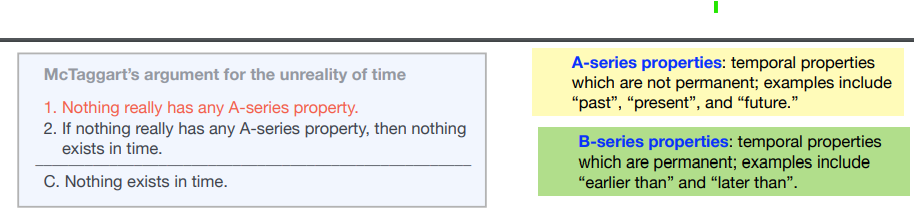
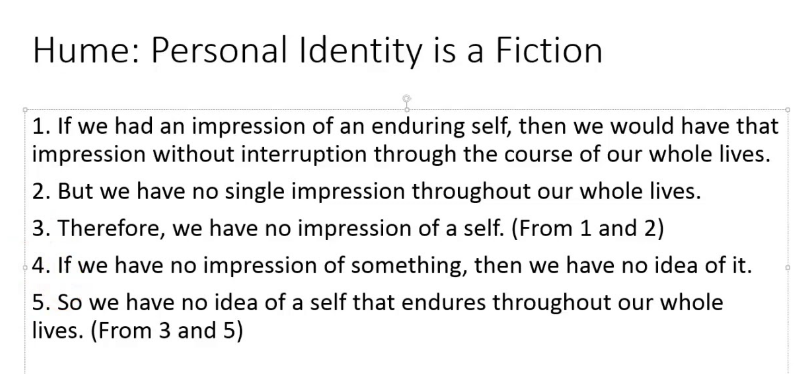

Oh boy, first post and it's for an absolutely crazy semester. Alright, *ahem*, let's do this.

After arriving back from the depths of my coop at <a href="https://powerex.com/" target="_blank">Powerex</a> trust me when I say that I was not looking forward to returning to school. Not only was I enjoying the free coffee and soft drinks at the companies downtown office ***a bit*** too much, but it's also a uniquely relaxing feeling to not have to worry about classes.

So I seeked for another coop this semester.

Along with seeking I also enrolled in four courses:
- <a href="https://www.sfu.ca/outlines.html?2023/fall/cmpt/307/d100" target="_blank">CMPT 307 - Data Structures and Algorithms II </a>
- <a href="https://www.sfu.ca/outlines.html?2023/fall/cmpt/371/d100" target="_blank">CMPT 371 - Data Communications and Networking </a>
- <a href="https://www.sfu.ca/outlines.html?2023/fall/cmpt/376w/d100" target="_blank">CMPT 376W - Professional Responsibility and Technical Writing </a>
- <a href="https://www.sfu.ca/outlines.html?2023/fall/phil/203/d100" target="_blank">PHIL 203 - Metaphysics </a>

## The market shows its true colors

Some rapid-fire stats for this seeking semester:
- 91 applications
- 4 OAs
- 7 interviews
- 1 offer
- 45 LC problems sprinkled through the semester

I mainly applied to SWE/SDE roles and targeted medium/larger companies and/or companies with 4 month positions. This seeking semester was particularly rough due to market conditions.

I soon, among other invites, received a SWE interview invite for ATPCO and I was pretty excited. I quickly gave my interview availability on the day of the invitation and prepped for the interview. I received radio silence for a week and a half, so I followed up. Turns out they hired someone internally. A great way to start the seeking term.

Fast forward to mid-way through the semester I was getting quite disheartened after so far fumbling the bag with interviews for a SDE role at SAP and at two SWE roles for Copperleaf. This combined with midterms made me frusturated and stressed. I did not think I would be able to land a coop this semester, but I kept going.

Determined, I attended the CSSS Tech Fair and printed copies of my resume to hand out. Particularly, I talked to one of the boothers at motorola who happened to be an SFU coop student. We traded linkedin connections and he talked about his previous coop at PaybyPhone. Funny enough, the day after I received an interview invite for a SWE role at PayByPhone. I would like to mention that I also dm'd my resume to the recruiter of this position on linkedin and she seemed happy to receive it which may or may not have played a role in receiving the interview. Anyways, I quickly reached out to the SFU coop student and he shared some advice about the interview process. With this information, I went to work on prepping.

The day before the interview I was getting a bit worried. I've received no follow-ups after sending in my availability the week before. I don't know who's interviewing me and the day of the 1st possible interview slot was coming up. Surely this wasn't an ATPCO rerun.

Unfortunately, I soon received the dreaded email that the position was cancelled. Back to the drawing board.

It did not take until the last week of school and a week before finals to receive my next interview invite and at this point I was innundated by final projects and exam prep. It was at ICBC for an SDE role. This was a role I applied to months before and I completely forgot I applied to it. On one hand I was relieved to have one more chance, but on the other hand I was freaking tired of this semester. Particularly, CMPT 307 (algorithms II) was taking up a lot of my time.

Nevertheless, I put forth my best foot. I found the current coop in that role on linkedin and funny enough it happened to be someone who was a [DFG](https://www.developforgood.org/) alumni. I asked a bit about his time at the company and the interview process and also about his experience at DFG. We had a nice chat and I then prepped for the interview fingers crossed that the role wouldn't be cancelled.

I think the interview went well. I liked the interviewers and it was a nice conversation. They said they would contact me the day after since they had a few more interviews to conduct. I kept refreshing my email the day after instead of studying and I got dopamine spikes from the ding of a new email seeping its way into my sfu inbox. Some emails were literally rejection emails from other roles that I applied to, *sigh*. 

I then received the coveted email from ICBC for the offer. Some stress lifted at that moment knowing that I didn't need to continuing seeking this semester because at this point the market was so dry it was like debugging code in a desert – searching for a missing semicolon in a sandbox of code (yeah, I stole this from chatgpt). I quickly accepted the offer, of course.

## CMPT 307 - is this a CMPT or a MATH class?

I knew this was going to be a tough course and I made sure to enroll in it with all my friends so we could suffer together. I took it with Brad Bart who had some interesting [RMP](https://www.ratemyprofessors.com/professor/20266) reviews such as this incredible megamind of a comment.

Maybe I have terrible english comprehension because I still don't know what the reviewer is trying to say, but it's probably very insightful as per its solid 3 upvotes. 

Anyways, CMPT 307 is the Data structures/Algorithms II course at SFU and it mainly goes over more advanced algorithms/data structures and proof techniques building on top of CMPT 225 (the prereq).

The course had weekly assignments and 2 "quizzes" (basically midterms) with one final. Oh, and you get a free 3% for reflective exercises. The assignments were pretty hard, but helped solidify the concepts from the lectures. 

I felt like I kind of understood the material until I got the results back from my midterm 2. A solid 34%. What the heck? I was ~20% below average so I underperformed pretty hard. The day after the grades were released my ominous prof handed out the marked exams back in class. I attended (as I often do - well sometimes), and snatched my paper pretty quickly. I knew I did poorly but from counting the possible marks in my head it seemed like I'd at least get average.

It turns out I made some pretty dumb mistakes such as e.g., careless mistakes on inductive subsitution and from coloring an RB tree. Anyways, we'll clutch it back up on the finals. I did OK on the first midterm and well on assignments so I knew worst case I would pass and push P on the class.

The finals were quickly approaching. Coming out of securing ICBC I had roughly a week left until my 307 final. It was a pass/fail final so I basically had to secure a 50%. I was sweating beads.

The day of the final and it was freezing. I woke up early because I couldn't sleep. I left for the R5 and as I approached Burnaby Mountain I was noticing frosty droplets cascade down from the sky. Yup it was snowing.

    

The final had two sections. Section A was allocated ~25-45 minutes and Section B was allocated the remaining time. Basically you flagged a TA when you're done section A and then continue on to the next section.

Section A was a mix of short answer, fill in the blank, and multiple choice. Basically, there were no part marks. Not going to lie every question here was kind of hard except the multiple choice. I distinctly remember guessing most of the short answers.

Section B was 100 of the 150 marks of the final. There were 6 problems and you picked 4 of the 6 to complete. These questions were in 3 groups (1,2), (3,4), (5,6) and you must pick at least 1 from each pairing. Each question was worth 25 marks.

I kind of wish I spent more time on part A since you will have plenty of time on part B (basically ~2 hrs for 4 problems). Either way, I coped the way back home after that final.

The grades were back pretty quickly and I got ~43% on the combined sections. At this point I thought I needed to retake, but the average was so low I ended up scraping with a B- with a C class average. Thank the lord.

## What the heck is Metaphysics?

That's what I asked myself when I first enrolled in PHIL 203. You see, at SFU the main options for 200 lvl PHIL "required" courses  (in the sense that they unlock a substantial number of upper div courses) hide behind either PHIL 203 (Metaphysics) or PHIL 201 (Epistomology). Since I took a psuedo-Epistemological course in high school called "Theory of Knowledge" I decided that it would probably be more interesting to enroll in a metaphysics course.

To answer what metaphysics is well it basically asks questions about what reality actually is. It often explores abstract concepts like time, space, identity, causality, and consciousness. My professor described it as us starting with physics and then needing to go back to justify the underlying assumptions made for its claims.

This course is basically split into two parts. In the first half we covered **Time** and in the 2nd half we covered **Identity**. We wrote one essay on each part based off a chosen prompt.

For Time we went over readings from Aristotle, Augistine, Newton, Bergson, and McTaggart. For Identity we went over readings from Plato, Aristotle, Locke, Reid, Hume, and Whiting.

If I were to pick favorites then McTaggart and Reid would probably be up there. McTaggart is interesting because he believed that time is an illusion and sets up a (surpringly) simple argument to prove his point. Credits to <a href="https://www3.nd.edu/~jspeaks/courses/2009-10/20229/LECTURES/4-mctaggart.pdf" target="_blank">Source</a> for the image.

This has apparently sparked debate among the metaphysics community even until now, so it's fairly influential.

Reid I simply like because he's a very "common-sense" type of philosopher. In this class we mainly learnt about him in the context of him dunking on Hume who's dunking on Locke's observations on identity. He mainly refutes Hume's conclusion that there is no self. Hume's take can be summarized below

I think <a href="https://www.youtube.com/watch?v=2THlBkg3EUU" target="_blank">this video</a> breaks down how Reid tackles this argument better than I can. 

Anyways, this class was pretty enjoyable and my <a href="https://www.sfu.ca/philosophy/people/faculty/profiles/holly-andersen.html" target="_blank">professor's</a> passion for the subject was infectious so I think I made the right choice picking this over PHIL 201.

## Wait, so you're telling me a shrimp fried this rice?

I had no idea what to name this section, but it felt... off to not talk at least ***a bit*** about CMPT 376 and CMPT 371 (might as well round out the course reviews). Even though I don't have too much to say about either course.

**CMPT 376** is a technical writing course and I took it with Angelica Lim. She's a great professor. Even though it was her first time teaching the class she seemed pretty passionate about the topics taught and even brought in a guest speaker for a lecture. The first half of the course dealt with ethics and the second half dealt with technical writing. You will use latex in this course which I think is something nice to know about.

**CMPT 371** is a networking course and I took it with Ouldooz. There's so much memorization in this course, but since everything was open book it made the course a lot easier. This course is 95% theory and 5% coding with the final mini project. Be prepared for a lot of theory. Since networking courses at most universities are standardized you can pretty much survive off of this <a href="https://www.youtube.com/watch?v=74sEFYBBRAY&list=PLm556dMNleHc1MWN5BX9B2XkwkNE2Djiu&index=1" target="_blank">YT playlist</a>. 

## Wait, that's it?

And that pretty much wraps up my fall semester in terms of my coop seeking and courses. Stay tuned for future posts. :) 

