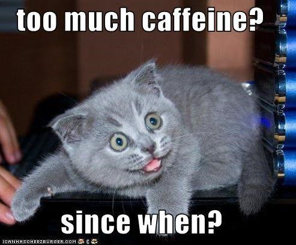
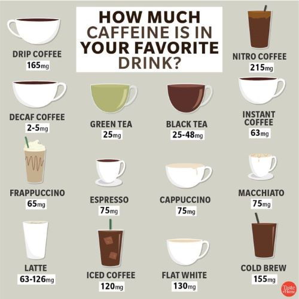

"Can I get a UHHH cold brew" - Tims

_daring today arent' we_

If you are a student at SFU then you may be one of the many hostages to a Tim's coffee addiction. Even if you are a random passerby, you probably have some go to coffee place as your guilty pleasure or something.

So... coffee makes you feel super productive sometimes; however, how much of it is actually placebo and how much of it is actually legit?

I didn't really question its efficiency until last year when I started seriously looking into why I jitter so much.

## Why I don't drink coffee (as much) as before

So coffee sometimes gives me insane brain fog. ~~It's like when you play hours of League.~~ And I found that it honestly didn't even help me concentrate some days. I've been an avid coffee drinker since I was ~15 so this realization was something I've felt but not something that I've really ruminated about. To be honest I kind of accepted it as the truth. After thinking about it let's say roughly speaking that coffee works 50% of the time. So 50% of the time it benefits me to being productive and the other 30% it gave me headaches and spikes my anxiety. Let's also say that the final 20% it causes show-stopping pain like icepick headaches or causes me to crash. Would you take that risk?

To be honest, I wasn't sure anymore. Hence, I looked into exploring other options. I mainly explored other types of coffee, tea, and lemon water. I needed to find a drink that will keep me awake while not making me crash (as hard).

## Trial and Error

So before mid-2023 I mainly stuck to instant coffee and iced coffee/cold brew. To expand my horizons I later tried:

### Mocha

Mocha is 50% chocolate and 50% coffee usually, so basically you are trading off caffiene for sugar. Sounds good at the moment, not a great idea later! I don't know what it is but let's just say that combination makes me go to the washroom too many times to count.

### Lemon Water

So something interesting that may sound obvious is that lemon water != lemonade. The latter has much higher sugar content. Okay now that's out of the way, I usually get Mcdonald's lemon fruit splash. It's not very sweet and is kind of perfect for summer weather. Though, it will not keep you awake but sometimes all you need is a side-bevarage to sip on and lemon water is the best companion for that.

### Sparkling Quenchers

These are from tim hortons and you can either get the Blackberry Yuzu or Orange Ginger flavour. These are ligtly fizzy and not very sweet. I'd say they are also similar to Lemon Water being a good side-berverage but not something that will help you stay productive.

### Tea

So many types... I've tried green tea, jasmine, earl grey, and peppermint (might be missing a few). I liked them all but peppermint was probably my least favoruite. The nice thing about tea is... well it kept me awake while saving me from brain fog and crashing later. I talk more about why I enjoyed drinking tea specifically later.

## Not all coffee is built the same

In addition to mocha being a type of coffee I learnt from this journey that not all coffee has the same caffiene content.

I've always wondered what the difference between cold brew and iced coffee was and turns out it's mainly the caffeine content (+ cold brew is more smooth and less acidic) From above you can see the drink caffiene level goes:

Cold Brew > Iced coffee > Mocha (not on graphic) > Instant Coffee

## Why you should drink tea

Now for the actual important part of this blog: **_why you should drink tea_**.

### Less Caffiene

Probably the most obvious reason is that tea has significantly less caffiene than coffee. Like, way less. And for me it turns out you don't need _that much_ caffiene to stay functional. Really, you just need a goal (have a deadline creeping up) and a "switch" that dials you in to complete that task. I kind of treat the "switch" as my drink + where I'm studying. From my experience, as long as you make the switch relatively easy to obtain then you will find yourself a lot more productive.

### No more brain fog/anxiety

Tea kind of has the opposite affect of coffee. Whereas coffee causes your brain to race tea causes it to relax. If you find yourself feeling more anxious after coffee then tea might be your solution.

### Cheaper

Tea is also so much cheaper than coffee. Whether you are buying tea outside or making it from home you can basically bulk buy tea for a fraction of the cost of making or buying coffee yourself.

## Conclusion

Although I'm no longer a slave to coffee I still do sometimes drink it. It's just that tea has undoubtedly taken its throne as my chosen drink to actually get stuff done.🍵
