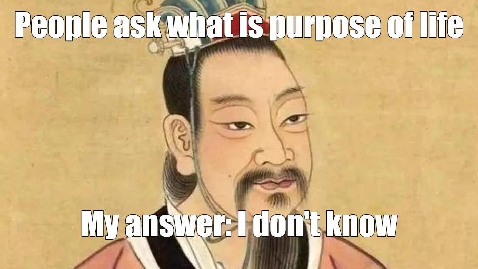

# Walking Through Asian Philosophy

I took Asian Philosophy with [Prof. Bommarito](https://www.nicbommarito.com/philosophy) at SFU and it ended up being one of the more memorable philosophy courses from my degree. Before this class, most of what I knew came from random references to Buddhism or Daoism.

So this post is my attempt to walk through some of the thinkers and texts we covered. Obviously, cramming centuries of Indian, Chinese, and Japanese philosophy into one blog post is a bit ambitious. This isn't supposed to be a definitive guide. It's more of an introduction to a side of philosophy that schools tend to skip over in favour of the Western canon in the format of **introduction** : **some quote I liked**.

Shoutout to Nicholas for teaching this stuff. He is probably never going to see this, but still.

> 💡 A lot of these traditions come back to the same deceptively simple questions: What is the self? Why do we suffer? And how the heck are we supposed to live?

## The Upanishads  

The Upanishads start with the question: what is *actually* real? 

Their answer is that beneath everything is a deeper reality called *Brahman*. Your inner self, or *Atman*, isn't really separate from it either. We suffer because we treat ourselves as isolated little beings when the boundary between us and everything else is not as solid as it looks. Liberation comes from recognizing that unity rather than just understanding it as an abstract fact.

> “That which is the subtle essence, this whole world has for its Self. That is the true. That is the Self.”  
> — *Chandogya Upanishad*

## The Bhagavad Gītā  

The Bhagavad Gītā is basically a philosophical crisis happening in the middle of a battlefield. Arjuna is supposed to fight, but the people on the other side include his own relatives and teachers. Understandably, he does not feel great about this.

Krishna responds by laying out different ways to live: acting without selfish motives, pursuing knowledge, and devoting yourself to the divine. The part that stuck with me is that you still have to act, but you don't have to obsess over the result. As someone who can spend way too much time thinking about whether something will work out, easier said than done.

> “You have a right to your actions, but never to the fruits of your actions.”  
> — Krishna, *Bhagavad Gītā*

## The Dhammapada  

The Dhammapada is less interested in explaining the structure of reality and more interested in what is happening inside your head. Your habits of thought shape how you experience everything else. If anger, craving, and resentment are constantly running in the background, then surprise: you are probably not going to have a great time.

This makes ethics feel less like a list of commandments and more like training. Attention and discipline are tools for slowly changing how you react to the world.

> “All that we are is the result of what we have thought.”  
> — The Buddha, *Dhammapada*

## The Cārvāka School  

Cārvāka is the wildcard of the bunch. While everyone else is discussing karma, liberation, and the self, Cārvāka basically responds: "Can you prove any of that?"

The school rejects an afterlife, karma, and a permanent soul because none of them can be directly perceived. If this life is the only one we know we have, then pleasure and pain matter a lot more than some hidden cosmic order. I find it funny that even thousands of years ago there was already someone in the group project challenging the entire premise.

> “While life remains, let a man live happily, let him feed on ghee even though he runs in debt.”  
> — Attributed to the Cārvāka school

## The Analects  

Confucius brings things back down to everyday social life. Instead of escaping society, the goal is to become a better person *within* it. That means taking your relationships, responsibilities, and rituals seriously.

At first, the emphasis on ritual sounded overly formal to me. But ritual here isn't just bowing correctly or following ceremonies for no reason. It also means practicing respect until it becomes part of your character. For Confucius, a healthy society starts with people learning how to treat one another properly. No pressure.

> “The man of virtue makes the difficulty to be overcome his first business.”  
> — Confucius, *Analects*

## Mengzi (Mencius)  

Mengzi takes Confucianism in a more optimistic direction by arguing that humans naturally lean toward goodness. His famous example asks you to imagine seeing a child about to fall into a well. Your immediate reaction would probably be alarm, not because you want praise or a reward, but because some amount of compassion is already there.

The catch is that these moral instincts are more like sprouts than fully grown trees. They can grow, but they can also be neglected. Education is supposed to cultivate what is already present rather than shove morality into us from the outside.

> “The feeling of commiseration is the beginning of benevolence.”  
> — Mengzi, *Mencius*

## The Daodejing  

The Daodejing is very suspicious of our need to control everything. It presents the *Dao* as the natural way things unfold when we stop trying to force them into our plans.

This is where *wu wei*, usually translated as "non-action," comes in. It doesn't mean lying in bed and doing absolutely nothing (unfortunately). It is closer to acting without forcing things: knowing when to move, when to adapt, and when your interference is only making the problem worse. The more rigidly we chase power or a specific result, the further we can move from harmony.

> “The Dao that can be spoken is not the eternal Dao.”  
> — Laozi, *Daodejing*

## Zhuangzi  

Zhuangzi takes Daoism and makes it weirder (in a good way). The text is full of talking animals, strange characters, and stories that make you question whether your viewpoint is really as obvious as you think it is.

What looks useful from one perspective can look useless from another. The same goes for success and failure, right and wrong, and even the boundary between yourself and everything else. The butterfly dream is the most famous example: Zhuangzi dreams that he is a butterfly, wakes up, and then wonders whether he is actually a butterfly dreaming that he is Zhuangzi. Good luck sleeping after that one.

> “Once Zhuang Zhou dreamed he was a butterfly…”  
> — Zhuangzi, *Zhuangzi*

## Nāgārjuna  

This is where things get a bit brain-melting.

Nāgārjuna argues that nothing has a permanent, independent essence. Everything only exists because of other conditions: a tree depends on soil, sunlight, water, and a whole chain of things that came before it. The same applies to people and the identities we build around ourselves.

He calls this *emptiness*, but that does not mean nothing exists. It means things don't exist in the fixed and self-contained way we assume they do. The distinction is important, even if it took me a while to wrap my head around it.

> “Whatever is dependently arisen, that is explained to be emptiness.”  
> — Nāgārjuna, *Mūlamadhyamakakārikā*

## Śāntideva  

Śāntideva asks why we treat our own suffering as uniquely urgent when everyone else's suffering feels just as real to them. If there is no permanent, independent self, then drawing such a hard line between "my problem" and "your problem" starts to look a little arbitrary.

This leads to the bodhisattva ideal: instead of pursuing liberation only for yourself, you commit to helping everyone else get there too. Wisdom without compassion is incomplete.

> “All the joy the world contains has come through wishing happiness for others.”  
> — Śāntideva, *Bodhicaryāvatāra*

## The Platform Sutra  

The Platform Sutra argues that enlightenment is not necessarily something you grind toward one level at a time. It can happen suddenly when you directly recognize your own nature.

That does not make study or practice pointless, but it does challenge the idea that awakening is a prize you earn after collecting enough philosophical knowledge. You can memorize every text in this post and still miss the point entirely. A bit humbling for anyone taking a philosophy course.

> “Enlightenment is originally without a tree, and the bright mirror has no stand.”  
> — Huineng, *Platform Sutra*

## Dōgen  

Dōgen goes a step further: practice and enlightenment are not two separate stages. You don't meditate now so that some future version of you can finally become enlightened. The practice itself is already an expression of awakening.

I like this because it makes philosophy something you actually *do*, not just something you agree with while reading a book. The point is not to finish thinking and unlock enlightenment. Every ordinary moment is part of the practice.

> “To study the self is to forget the self.”  
> — Dōgen, *Shōbōgenzō*

## Why This Still Matters  

What surprised me most about this course was how practical a lot of it felt. I have taken philosophy classes where you spend weeks trying to establish whether time is real or if their are multiple possible worlds (wtf metaphysics). Here, even the most confusing metaphysical ideas eventually come back to a basic concern: why do we suffer, and what can we do about it?

The ideas around attachment probably stuck with me the most. We attach ourselves to grades, careers, relationships, beliefs, and whatever identity we have built up in our heads. None of those things are automatically bad. The problem is treating them as permanent parts of ourselves and then being shocked when they change.

I obviously haven't transcended attachment because I took one course. I still get annoyed when something doesn't go according to plan. But recognizing the attachment at least gives me a second to step back and ask why I care so much. Sometimes that is enough to feel a bit more grounded.

Anyways, that's my extremely compressed tour through Asian philosophy. If nothing else, hopefully it shows that the tradition is much broader than a few motivational quotes about being present. There is a lot here, and I barely scratched the surface.
