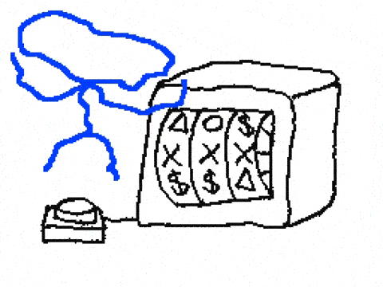

Today at my coop I was doing a particularly inordinate number of force pushes to my branch. Typically, this is a result of cleaning up its history to prepare for a PR. The workflow looked something like...

```
# 1. write some code to test something in a CI pipeline, make a commit.
# 2. run the pipeline workflow
# 3. ah shoot, I forgot to specify it to only run select jobs and on a specific runner
# 4. fixed in next commit
# 5. ah shoot, it failed.
# 6. ...
# n. now I'm left with 10 commits with msgs "test1..2...3" etc., with sprinkles of "please work#n" in between
```

To fix this I would do an interactive rebase and squash all the test commits into the first semantic commit and then force push onto my branch. Okay cool. But in the process I ran into an interesting stack overflow post [git push --force-with-lease vs. --force](https://stackoverflow.com/questions/52823692/git-push-force-with-lease-vs-force#:~:text=force%20overwrites%20a%20remote%20branch,elses%20work%20by%20force%20pushing.). This was interesting for two reasons. First, because I never used the `--force-with-lease` option and have never heard of it. And two, wait... did somebody mention Compare and Swap? Yes, in fact, `git push --force-with-lease` is a high level implementation of compare and swap. Consequentially, I decided to write a quick summary of my findings because hey why not.



**_Me seeing CS concepts in random places_**

### Compare and Swap

In the summer semester I enrolled in SFU's last offering of CMPT300: Intro to Operating Systems. One of the concepts in the course is Compare and Swap. CAS is implemented on an assembly level and it's used to enforce atomicity in multi-threaded applications to avoid race conditions. Basically, if I have two threads, thread A should be able to acquire a "lock" on a critical section preventing thread B from entering the critical section and mucking with its state.

### The Comparison

To understand how `git push --force-with-lease` is similar to compare and swap we need to first look at a high level implementation of compare and swap:

```C
int compare_and_swap(int *addr, int expected, int desired) {
    int temp = *addr;
    if (temp == expected)
        *addr = desired;
    return temp;
}
```

Then a [spinlock algorithm](https://www.geeksforgeeks.org/what-is-spinlock-in-operating-system/) would look like:

```C
while(compare_and_swap(&lock, 0, 1)) {
    /* Do Nothing */
}

# critical section
lock = 0
# remainder section

```

Basically, **only update one memory word** _if_ **its original value matches a given value**.

So why is this like force pushing with lease?

Well, when you fetch the state of a remote you actually pull in the latest ref of each branch. So say you want to force push with lease on branch A. The idea is that you take a "lease" on the latest state of branch A from the remote via a `git fetch`. Force pushing with lease will only work if your "lease" (local latest state of that branch) is the same as the one on the remote. The idea is that your local branch should not have diverged from the remote which prevents most of the icky weird stuff to happen from overwriting history.

This idea of checking if something is the state of something else and hasn't diverged from what is "expected" is basically what compare and swap is doing. It sounds pretty simple and it kind of is, but it goes to show how simple algorithms underly complex systems.

### Conclusion

Use `git push --force-with-lease` instead of `git push --force`.
