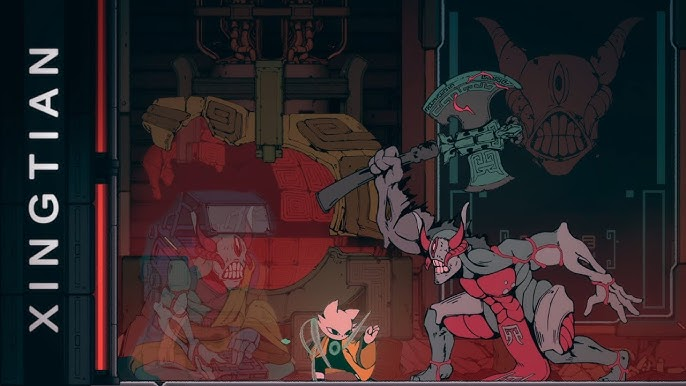
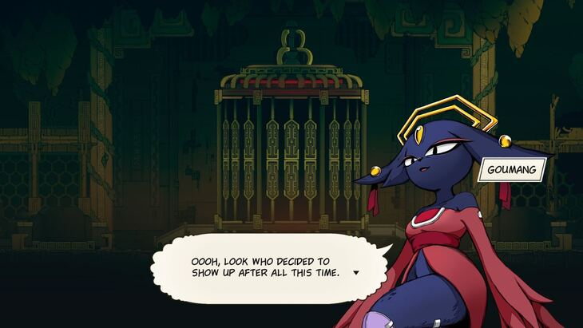
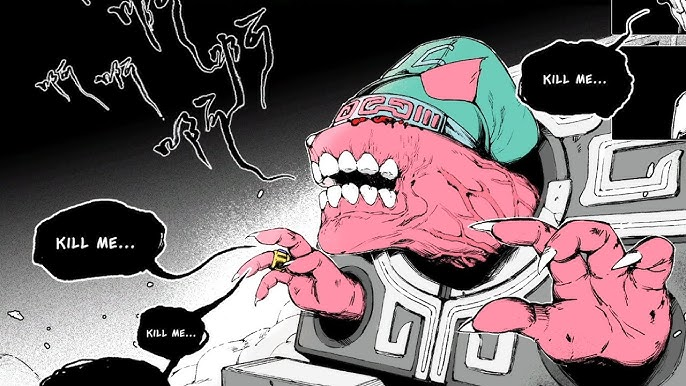
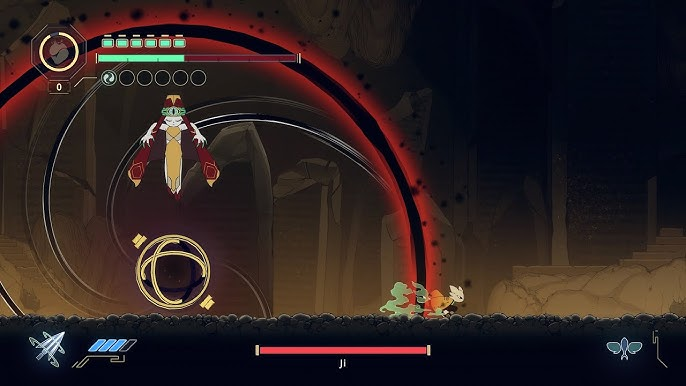
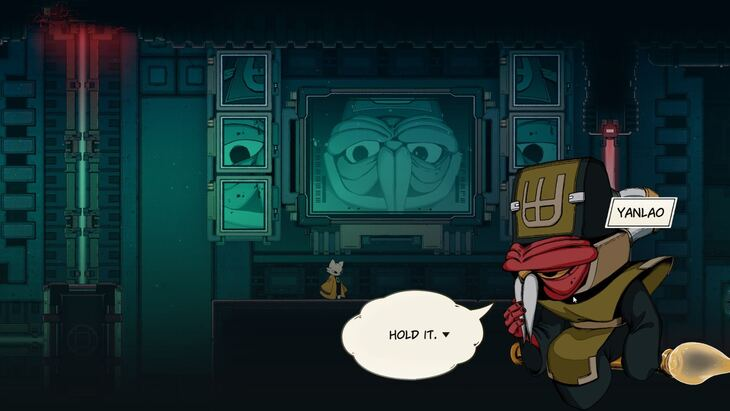
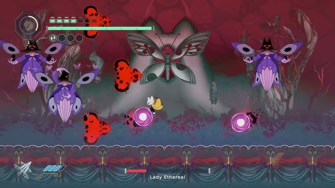
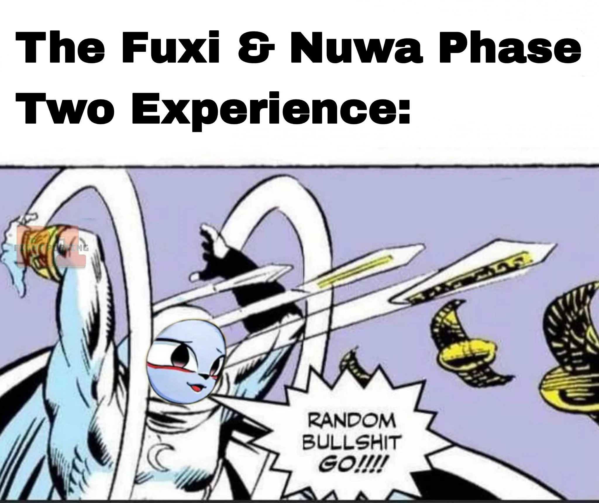
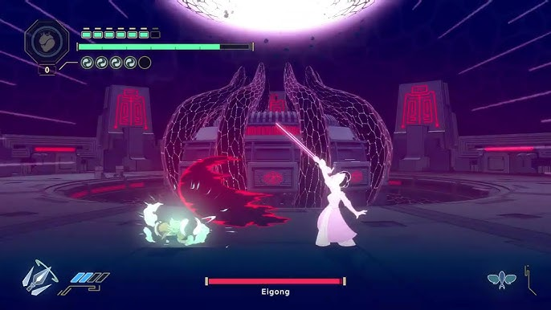

A metroidvania with tons of flare: Nine sols touts itself as a unique blend of Taoism meets cyberpunk. I originally got the game due to the steam winter sale and I don't regret it one bit. Here I will rank every boss from Nine Sols by difficulty ~~because I need more things to write about.~~

### ⚠️ Warning! Spoilors ahead, of course. ⚠️

# 10: Xingtian

 <b>Difficulty: ⭐2.5/5</b> 

I honestly struggled with the overworld mobs more than this boss. As one of the two "powerful" Battlelord Prototypes that Yanlao preserved he sure doesn't have a variety of attacks. He mostly spams the same rapid fire downward axe cuts, which can easily be parried. He is the first boss you encounter that self-heals, but this is easily interruptable due to the constraint environment. Overall, with just one phase you can easily brute force this boss in 2 minutes without much strategy except mashing your buttons.

# 9: Goumang

 <b>Difficulty: ⭐3/5</b> 

Goumang is one of those bosses that it seems most people in the Nine Sols community found to be a simple fight. Even as the 2nd boss in the game some users literally skipped the 1st boss to beat Goumang first (since thats possible, though I did it in order). You don't even fight Goumang. Instead, you fight two jiangshis that she ocassionaly swoops down to revive. It's at this duration that you may damage her. The thing is she has a very small health bar. If you can bring her down ~3/4 times you can knock her health bar to zero if you save your charm detonations and arrows. Overall, I think she needed a 2nd phase to be at the same level as other bosses in the game.

# 8: Kanghui

 <b>Difficulty: ⭐3.2/5</b> 

I think Kanghui is only _marginally_ harder than Goumang. The sequence to get to the boss was frusturating though. This bosses gimmick is mainly just spamming mobs and overwhelming you with them. I think from netizens online it seems the main issue with this boss is that there's a good chance you may go in underleveled. And theres no way to improve your equipment once you get to Kanghui, which means you must skill check him or else. When I reached him I was a bit over-equipped due to difficult previous bosses, so that probably led to him not being so bad.

# 7: Ji

 <b>Difficulty: ⭐3.3/5</b> 

Ji is one of the most fun bossfights in the game. He's on the easier end because his attacks are fairly telegraphed. You can choose the flavor of attacks based on the orb you land on when he's spinning his wheel, or else he'll select an orb at random. Once you learn his attack patterns for each orb he becomes very easy. Most of his attacks are easily parryable and his crimson attacks give you a lot of airtime to unbounded counter.

# 6: General Yingzhao

 <b>Difficulty: ⭐3.5/5</b> 

I really struggled with YingZhao. He's the first boss in the game so understandably you go in fairly naive. You think you're a big shot from the overworld mobs, but Yingzhao is in an entirely new court. He forces you to parry and if you don't well have fun. Overall, you have to rely on your talismans for damage in this fight and play it slow.

# 5: Yanlao

 <b>Difficulty: ⭐3.7/5</b> 

What seems to be a fairly simple boss turns out to be one of the more difficult ones. I don't know what it is, but I struggled with Yanlao. And you really are fighting the sky rendering claw that he pilots, but still. Nothing really crazy, I think the hard part is dodging the lasers while parrying the claws charge attack. So he isn't difficult in terms of the attack patterns, but if you mess up even once in this fight you will be punished from multiple sources which can make the boss feel difficult.

# 4: Jiequan

 <b>Difficulty: ⭐4/5</b> 

Jiequan is frusturating to fight... until you realize you can unbounded counter his overrhead red attack. He also cycles in some red attacks in his usually attacks that require you to adapt and counter. When you get to this boss its likely you've been mostly parrying everything so this encounter is really where that starts becoming unviable fast.

# 3: Lady Ethereal

 <b>Difficulty: ⭐4.2/5</b> 

Lady Ethereal is the 1st 3 phase boss in the game, so it's really a battle of endurance. She will spam clones and you have to quickly figure out which one is the real one. In the 3rd phase if you get hit by her "spirit bomb" you pretty much get KO'd, so you have to be fairly careful there. It took me several tries, but it was a very fun boss.

# 2: The Fengs

 <b>Difficulty: ⭐4.5/5</b> 

Very annoying siblings. Like the meme suggests, you basically are assaulted constantly. There's very little time to dodge/counter the constant stream of attacks. It's also a very non-telegraphed fight as far as the types of attacks go. They just do a bit of everything. God forbid you breathe during this fight.

# 1: Eigong

 <b>Difficulty: ⭐5/5</b> 

The difficulty jump between the Fengs and Eigong is crazy. It's just a very hard fight. The attacks aren't easy to counter, shes fast, teleports, and there are very few windows where you can actually do damage to her without getting whooped. I barely beat her and it was mostly luck. You really have to nail every mechanic in the game, which makes it a very fitting final boss.
