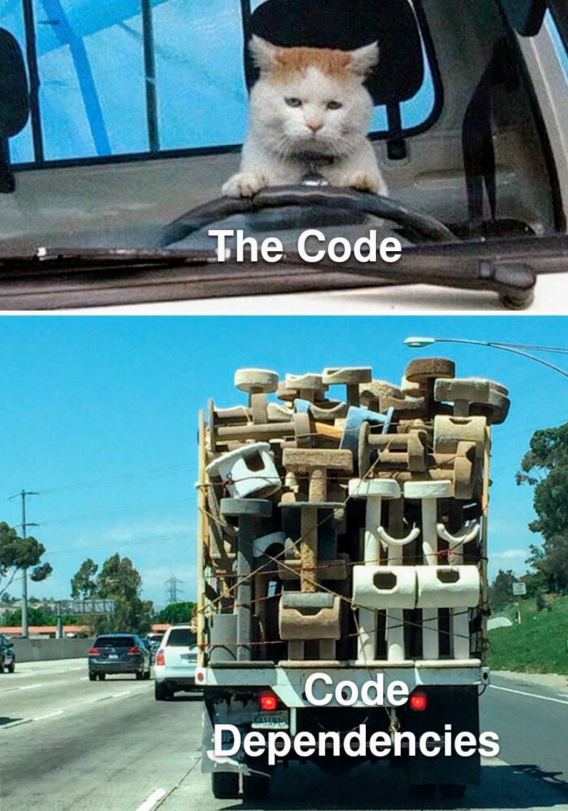

Another month another exploit. This time it's with NPM - a package manager that I personally have a love and hate relationship with.

### The Exploit

Well, school just started and npm got pwned. Specifically, Chalk and debug and a ton of other packages were pwned. Yes, the same chalk you use to make your console.logs pretty. Turns out a maintainer got phished by a fake npm support email and the attacker pushed malware that swaps your crypto wallet address.

Affected packages? Basically any of these packages open sourced by user `qix`

- **ansi-styles** — 371.41m downloads per week  
- **debug** — 357.6m downloads per week  
- **backslash** — 0.26m downloads per week  
- **chalk-template** — 3.9m downloads per week  
- **supports-hyperlinks** — 19.2m downloads per week  
- **has-ansi** — 12.1m downloads per week  
- **simple-swizzle** — 26.26m downloads per week  
- **color-string** — 27.48m downloads per week  
- **error-ex** — 47.17m downloads per week  
- **color-name** — 191.71m downloads per week  
- **is-arrayish** — 73.8m downloads per week  
- **slice-ansi** — 59.8m downloads per week  
- **color-convert** — 193.5m downloads per week  
- **wrap-ansi** — 197.99m downloads per week  
- **ansi-regex** — 243.64m downloads per week  
- **supports-color** — 287.1m downloads per week  
- **strip-ansi** — 261.17m downloads per week  
- **chalk** — 299.99m downloads per week  

Source: https://www.reddit.com/r/cybersecurity/comments/1nbqs7c/largest_npm_compromise_in_history_supply_chain/

### The Aftermath

Thankfully, the exploit only lasted a few hours and stole **only** a few big macs worth of ethereum (hey in this economy that's quite a lot have you seen the mcdonalds price inflation?)

Moral of the story? Lock your versions, audit your deps, and maybe don’t click on emails from npmjs.help. Oh, and maybe consider that the prettiest colors in your console might actually cost you real green.

